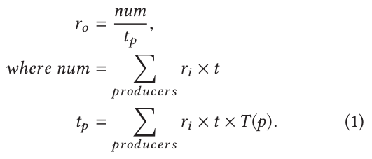
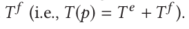
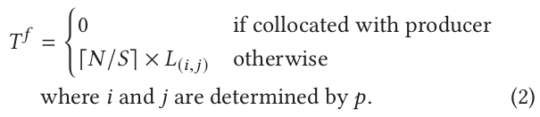
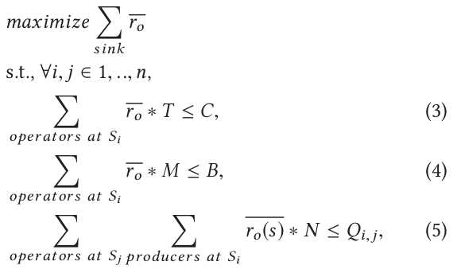

# **BriskStream: Scaling Data Stream Processing on Shared-Memory Multicore Architectures**

### 1.  Sources

[Shuhao Zhang](https://dblp.org/pers/hd/z/Zhang:Shuhao), [Jiong He](https://dblp.org/pers/hd/h/He:Jiong), [Amelie Chi Zhou](https://dblp.org/pers/hd/z/Zhou:Amelie_Chi), [Bingsheng He](https://dblp.org/pers/hd/h/He:Bingsheng):
**BriskStream: Scaling Data Stream Processing on Shared-Memory Multicore Architectures.** [SIGMOD Conference 2019](https://dblp.org/db/conf/sigmod/sigmod2019.html#ZhangHZH19): 705-722

🔗 https://dblp.org/rec/conf/sigmod/ZhangHZH19

### 2.  Abstractin & Introduction

- 本文解决的问题？
  - 已有的 DSPSs 都没有充分利用 underlying complex hardware micro-architecture，并且由于没有管理资源竞争和 unawareness NUMA(non-uniform memory access) 的影响
  - 如何找到一个 **streaming execution plan** 以实现 在共享内存多核架构下的最大化 processing throughput 的 DSPS（data stram processing system）
- 使用的方法？
  - 上述问题的关键点在于：在不同的 execution plan 下，每个 operator 的处理能力和资源需求、以及远程访问内存的代价 都会发生变化。
  - 本文提出了 RLAS （Relative-Location Aware Scheduling）方法：
    - 在优化 execution plan 的过程中，考虑到每一对 producer-consumer 之间的相对位置
    - 能够感知 NUMA 的影响，并且能够更加准确的评估 application behavior ：给定某一执行计划，模型可以预测出 每个operator 的 throughput
    - RLAS 的核心就是 对 operator 的 **replication** 和 **placement** 同时进行优化：
      - 对 replication 进行优化：通过一个性能模型，找出 steaming pipeline 中的 瓶颈算子，然后增加瓶颈 operator 的 replication
      - 对于 placement 的优化：主要通过一个 branch and bound 算法以减小 placement solution 的空间大小
- 作者在 BriskStraming 系统中实现了 RLAS 方法，并且通过实验论证了 BriskStream 系统具有更高的 throughput 和 更好的 scalability

### 3.  Execution Plan Optimization

- straming execution plan 主要包含：
  - 如何分配每个 operator 到底层物理资源上（placement）
  - 每个 operator 应该使用的 replication 的数量（replication）

#### 3.1 The Performance Model

- 评估每个 operator 的 **output rate** 的方法：the rate-based optimization（PBO）

- 模型主要内容：

  如何根据 input rate 和 application execution plan 评估一个 operator 的 output rate ？

  

  其中：表示该算子处理每个tuple所需要的平均时间

  

  然后：

  表示 tuple 从上游算子传递到下游算子所需的时间。

- 评估出每个 operator 的 output rate 之后可以将 operator 划分为两种：

  - over-supplied：这种算子的 output rate 就很大概率成为系统的瓶颈
  - under-supplied

#### 3.2 Problem Formulation

- 本文优化的目标就是 在给定 input stream ingress rate 条件下，寻找一种最优的 replication level 和 operator placement 方案，使得 application processing throughput 最大化

- 前提条件：满足系统硬件环境的约束，所以 优化问题 可以形式化表示为：

  

### 4. Optimization Algorithm Design

- 新型的 optimization paradigm：RLAS—Relative-Location Aware Scheduling
- 优化算法的核心思想： 在给定 replication 级别设置的情况下 iteratively optimize operator placement，并且在每一轮迭代的过程中增加 bottleneck operator 的 replication level。
- 在 placement 优化过程中使用了 Branch and Bound 算法：具体上使用了三种启发式方法以显著减少结果空间：
  - Collocation heuristic
  - Best-fit & Redundant-elimination heuristic
  - Compress graph

