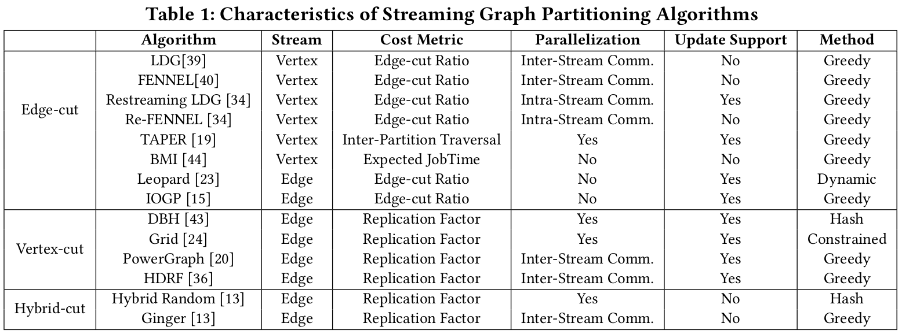
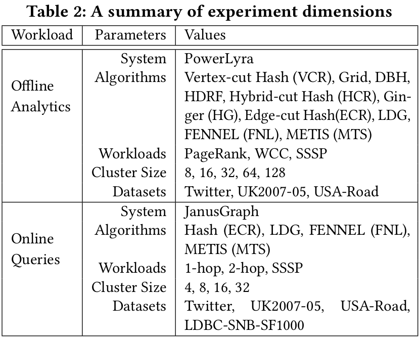

# **Experimental Analysis of Streaming Algorithms for Graph Partitioning**

### 1. Source

[Anil Pacaci](https://dblp.org/pers/hd/p/Pacaci:Anil), [M. Tamer Özsu](https://dblp.org/pers/hd/=/=Ouml=zsu:M=_Tamer):
**Experimental Analysis of Streaming Algorithms for Graph Partitioning.** [SIGMOD Conference 2019](https://dblp.org/db/conf/sigmod/sigmod2019.html#PacaciO19): 1375-1392

🔗 https://dblp.org/rec/conf/sigmod/PacaciO19

### 2. Abstract

- 什么是Graph Partitioning？
  
  Graph Partition 对于系统性能非常重要，因为它可以影响 load balancing 和 inter-machine communication。

- 什么是 Streaming model for graph partitioning？
  
  它能 to scale to very large graphs with limited resources。
  
- main objective of this study？

  To understand how the choice of graph partitioning algorithm affects system performance, resource usage and scalability

- 研究方法：

  主要分析 offline graph analytics 和 online graph query workloads。

  主要方法 edge-cut 和 vertex-cut approaches。

- 结论：

  - the no partitioning algorithms performs best in all cases。
  - 影响 graph partitioning algorithm 的因素：
    - type and degree distribution of the graph
    - characteristics of the workloads
    - specific application requirements

### 3. Introduction

- **Motivation** of the study：

  虽然有人提出了很多的 SGP 的方法，但是很少有关于这些方法在实践中的表现。

  已有的 performance 研究并没有包括：

  - the entire design space of SGP algorithms
  - their implications on runtime performance

  这些提出的算法的 Performance 分析 are usually conducted in a limited context。
  
  并且，分析的只是一些 objective functions（理论上），而不是 the workload performance in practice。
  
  所以，作者使用了 a diverse set of workloads and graph datasets 来 conduct a systematic experimental analysis of SGP algorithms，为了更好的理解 the implications of such formulation on performance and their impact on graph processing applications in practice。

### 4. Related Work

- **Scale-Out Graph Processing Systems**

  - graph analytics systems

    Pregel、Giraph、PowerGraph、PowerLyra

    —主要运行 offline analytical workloads

  - graph database systems

    Neo4j、JanusGraph

    —主要关注 real-time querying (reachability queries and subgraph matching) and manipulation of graph structured data

### 5. Streaming Algorithms for Graph Partitioning

### 6. Experimental Design

### 7. Experimental Result & Analysis

- Key Findings:
  - 已有的 SGP 算法不能容纳 多种多样的工作负载和 graph 特性，因此在 theoretical metrics 和 实际的 workload performance 之间存在 mismatch
  - 对于所有的workload，the network communication 随着 cut size 呈线性增长，并且增长的 slope 取决于 cut model 的工作负载
  - existing algorithms 都受 computational load 的 imbalance 问题困扰，并且 cut size 方面的改进 并不意味着 system performance 的改进
  - 已有的 SGP 算法对于 online graph query workloads 并不 effective，原因是 workload skew
  - workload patterns 可以被用于提升 online graph query 的 performance

### 8. Conclusion

- Directions for future work
  - develop algorithms consider the factors like Graph structure, workload characteristics and application requirements.
  - study the appropriate scale-out factor given a particular graph and workload characteristics