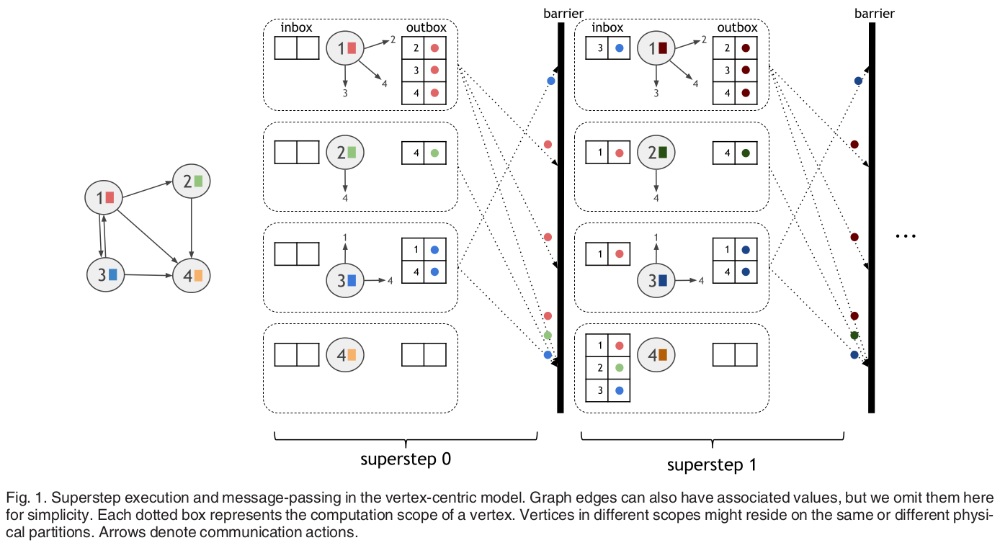
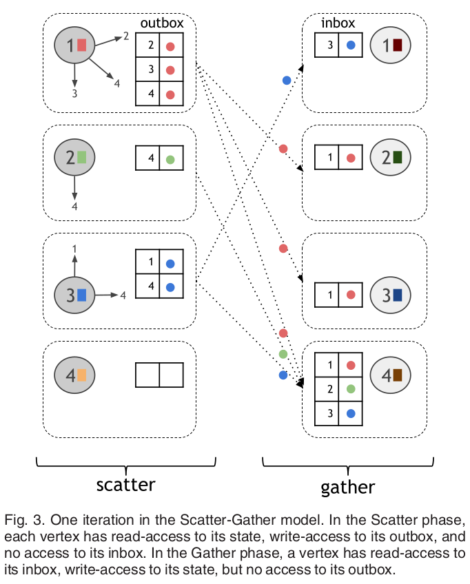
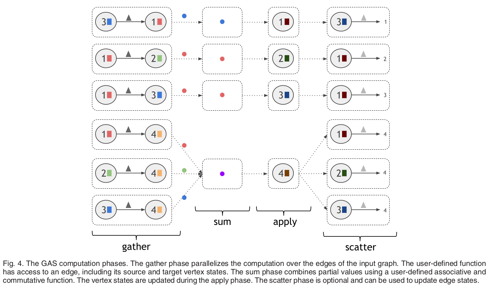
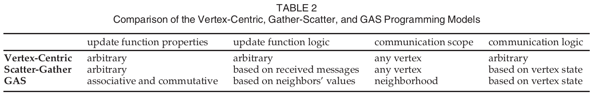
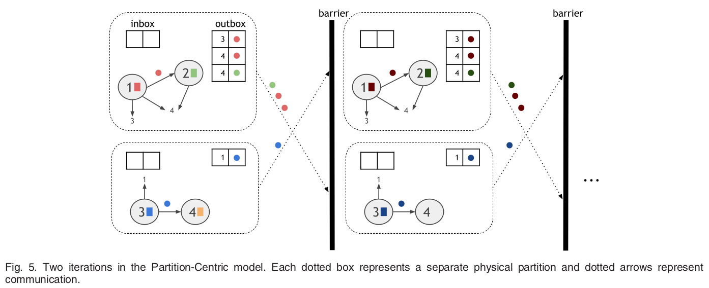
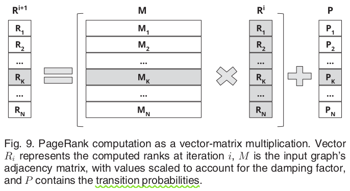
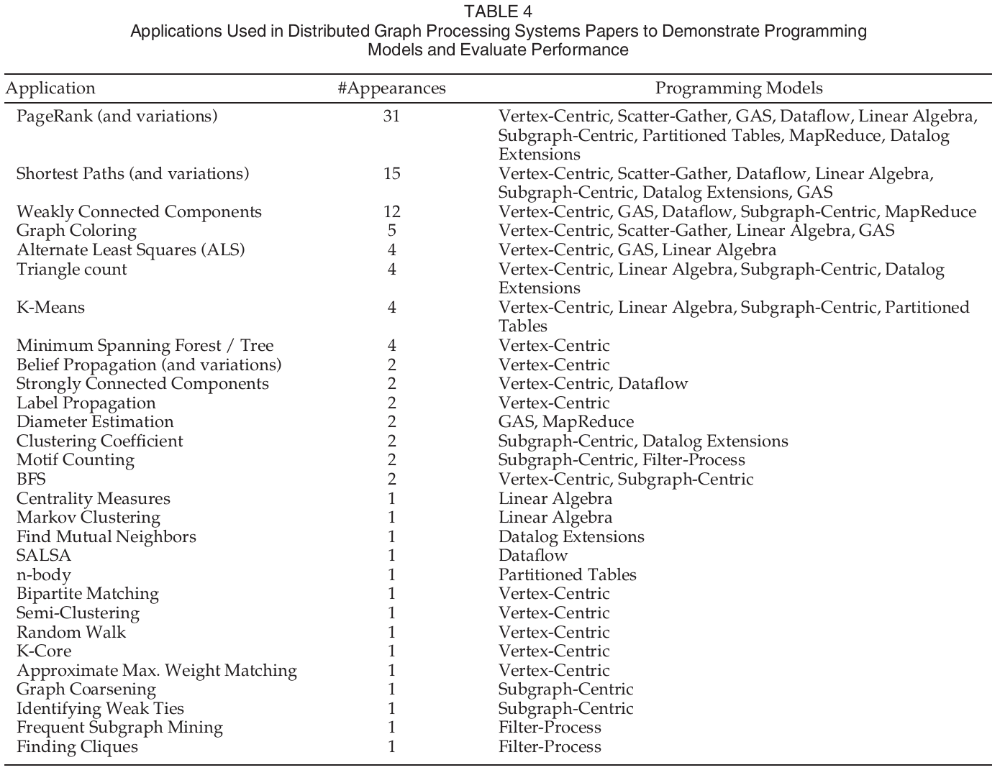

# **High-Level Programming Abstractions for Distributed Graph Processing**

### 1.  Source

[Vasiliki Kalavri](https://dblp.org/pers/hd/k/Kalavri:Vasiliki), [Vladimir Vlassov](https://dblp.org/pers/hd/v/Vlassov:Vladimir), [Seif Haridi](https://dblp.org/pers/hd/h/Haridi:Seif):
**High-Level Programming Abstractions for Distributed Graph Processing.** [IEEE Trans. Knowl. Data Eng. 30(2)](https://dblp.org/db/journals/tkde/tkde30.html#KalavriVH18): 305-324 (2018)

🔗 https://dblp.org/rec/journals/tkde/KalavriVH18

### 2.  Abstract & Introduction

- 图计算的应用领域？

  machine learning, recommendation, web search, and social network analysis

- 在开发高效分布式图算法中关键性的挑战？

  - Computation parallelization

  - data partitioning

  - communication management

  - **diversity graph applications/algorithms** : expose a variety of data access and communication patterns. 例如：

    iterative refinement algorithms —PageRank

    graph transformations

    graph aggregations

    pattern matching

    ego-network analysis

    graph traversals

- Why this work?
  - 为了解决 分布式图处理 的问题，很多的高层次的编程抽象和实现被提出。虽然它们的受欢迎程度不同，但是各有所长，而且没有一个 模型/抽象 可以 **efficiently and intuitively** 适应各种图应用。
  - 已有的研究都只是在 **实验** 的角度上比较了各种 the available distributed graph frameworks，没有对这些框架的编程抽象进行 qualitative comparison。
- Contributions:
  - review 高层次的分布式图处理编程抽象，分析它们的 execution semantics 和 users-facing interface。并且对其中一些图编程抽象的 performance limitations 进行了分析，并总结了一些合适的 extensions and optimizations。
  - 针对每种图编程模型，作者分析了它们可以 intuitively and easy expressed 的算法。另外，对于某些图处理抽象，作者给出了 hard or problematic to express 的算法。
  - 对34种图处理系统进行了分类，按照它们的 programming model、execution model、communication mechanisms。

### 3.  Programming Abstraction for distribute graph processing

- 什么是 distributed graph programming model？

  对于 定义 **graph data structures** 和 **the expression of graph algorithms** 底层计算基础设施 的一种抽象

  - high-level abstraction：向终端用户隐藏了 data partitioning 和 communication mechanisms 的抽象

    优势：简化，加速自动最优化的开发过程

    劣势：不够灵活，限制了个性定制的自由度

  - 分布式图处理的 programming abstraction 通常会提供

    - 输入图数据的 partitioned view：
    - a set of method：用以操作每个 partition，允许 read and modify 其上的数据，和其他的 partitions 进行通信

  - 编程模型在表达相应图算法的三种级别：

    - intuitive
    - unintuitive
    - difficult to express

**Six specifically distributed graph processing models：**

#### 3.1 Vertex-Centric

- 计算原理（think like a vertex）：最流行的 abstraction 之一，

  非常依赖 superstep 的概念

  - superstep 同步执行的原因？

    确保上轮 superstep 产生的 messages，能够在下一轮的 superstep 开始之前被传送到位

- 执行流程

  

- 代表系统：

  - Giraph (Pregel)
  - GraphLab (泛化的 vertex centric model: 引入了 vertex scope 概念)

- Applicability and Expressiveness

  - intuitive

    Iterative value-propagation 算法、fixed point methods map

  - difficult to express

    - Non-iterative graph algorithms: triangle counting
    - 发送消息至 the in-neighbors of a vertex： Computing strongly connected components

#### 3.2 Scatter-Gather

- 计算原理：vertex-centric 

  - 相同点：

    think like a vertex、synchronized iteration steps、使用 message-passing mechanism for communication between vertex

  - 不同点：

    将每次的 iteration step 划分为 *scatter* 和 *gather* 两个阶段：将 消息发送 和 消息收集以及状态更新 进行解耦合。

- 执行流程

  

- 代表系统：*Signal-Collect*

- Applicability and Expressiveness

  - 将消息传递阶段和 vertex value 更新阶段分开：
    - easier to follow and maintain 
    - performance optimization：不需要 concurrent 访问 inbox 和 outbox 数据

  - 适用场景和 vertex-centric 模型类似

  - non-intuitive：

    *Strongly Connected Components* and *Approximate Maximum Weight Matching*

#### 3.3 Gather-Sum-Apply-Scatter(GAS)

- 计算原理：
  - 解决了vertex-centric 模型在 power-law graphs 上的问题（主要是因为 degree skew 造成 computational imbalance）
  - 采用方法：parallelizing the computation over the **edges** of the graph

- 执行流程：

  

- 代表系统：Powergraph

- Applicability and Expressiveness

  应用非常广泛、模型可以用于模拟 vertex-centric programs、GraphLab vertex program、甚至 scatter-gather 模型

  - intuitive 算法：可以分解为 gather transformation 和 associative and commutative sum function

    PageRank

  - non-intuitive 算法：不能分解为 gather transformation 和 associative and commutative sum function

    Label Propagation **algorithm**

  - **对比**：

  

#### 3.4 Subgraph-Centric

##### 3.4.1  Partition-Centric

- 主要特点：将每个 partition 作为一个 subgraph，exposed to user-function

- 主要目的：为了 **节省 communication** 和 **加速 convergence**

- 执行流程：

  

- 代表系统：Giraph++（GoFFish、Blogel）

##### 3.4.2  Neighborhood-Centric

- 主要目的：加速 ego-networks（built around a central vertex of interest） 上图算法的实现

##### 3.4.3  Applicability and Expressiveness

- 模型的性能非常依赖于划分子图的质量

- The neighborhood-centric model：

  personalized recommendations、social analysis、anomaly detection、link prediction

#### 3.5 Filter-Process

- 计算原理： *think like an embedding*

- 适用场景：加速 graph mining algorithm 的开发，主要适合处理 subgraph enumeration and exploration 问题

  network motif discovery、semantic data processing、spam detection。

#### 3.6 Graph Traversals

- 代表系统：Apache Tinkerpop project
- 引入了 graph traversal machine and language： *Gremlin*

### 4.  General-Purpose programming models used for graph processing

- 为什么能用 通用的模型 来 构建 **domain-specific abstractions**？

  General-purpose models 能够提供更加底层的 primitives，因此它们能提供更广泛的应用、并且更加具有表达力。

#### 4.1 MapReduce

- 主要思想：

  扩展 MapReduce 框架 — 添加一个 driver 程序以协调 iterations，包含一个或多个 MapReduce jobs。

- 典型系统

  Pegasus，HaLoop，Twister

#### 4.2 Dataflow

- 计算原理：DAG model

  iteration 可以通过两种方式实现：

  - loop unrolling
  - 引入 complex iterate operators as part of execution DAG

  分布式应用程序编程抽象层次：

  - 显式地创建 task vertices 和 communication edges： Dryad 和 早期版本的 Stratosphere
  - declarative APIs： Spark、Flink

- 已有证明：vertex-centric、scatter-gather 以及其它的 iterative model 都可以使用 relational operations 来表示

- 代表系统（提供 high-level APIs and libraries for graph processing）：

  - GraphX（Spark）
  - Gelly（Flink）——Flink 使用 the delta iteration operator 构建的 iterative dataflows 可以实现 vertex-centric、scatter-gather、and Gather-Sum-Apply models
  - AsterixDB

#### 4.3 Linear Algebra Primitives

- 计算原理：主要利用了 graph 和 adjacency matrix representation 之间的 **duality**

- 执行流程：其实是计算 input graph's adjacency matrix 的 the dominant eigenvector（主特征向量）

  

- 代表系统：BLAS、Presto

#### 4.4 Datalog Extensions

- Datalog： a declarative logic programming language，通常被用作 deductive database 的 query language 

- 为什么 Datalog 可以用于表达 iterative graph algorithms？

  Datalog support recursions — 类似于 Recursive Aggregate SQL

  - 可以定义 efficient data structures 来表示 adjacency lists
  - 定义 recursive aggregate functions，可以使用 semi-native evaluation 进行 efficiently evaluate 

#### 4.5 Shared Partitioned Tables

- 计算原理：计算由一系列的用户自定义的 kernel 函数构成，这些函数在单个机器上执行，并且可以并行。Kernel instances 通过 shared distributed, mutable state 实现，这些状态被表示为 in-memory table，表中的元素被存储在不同的计算节点的 memory 中。
- 代表系统： Piccolo

### 5.  Categorization of distributed graph processing system

- Graph Analysis Applications 的分类：

  - *Value-Propagation*

    PageRank、Single-Source Shortest Paths、Weakly Connected Components、Label Propagation

  - *Traversals*

    Breadth-first search、Depth-first search

  - *Ego-Network Analysis*

    algorithm that compute **personalized metrics** using neighborhood information for each vertex

  - *Pattern Matching*

    graph mining algorithms： identifying cliques and frequent subgraphs

  - *Machine Learning*

    k-means clustering、Alternate Least Squares、Markov Clustering

