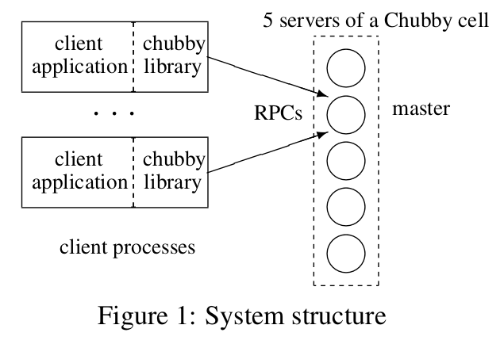

# The Chubby lock service for loosely-coupled distributed systems 论文阅读总结

​																																					——张帆  51184501176

### 1. Introduction

- ##### 什么是Chubby？

  Chubby是Google实现的一种**锁服务**，用于提供**粗粒度**的锁服务，和针对松耦合的分布式系统的**可靠存储**。Chubby可在大规模小型机器组成的松耦合分布式系统中实现同步、存储元数据、拓扑结构或者配置信息等功能。

- ##### 为什么需要Chubby系统？

  锁服务的目的就是允许clients能够同步activities，并且就clients之间的环境信息达成一致共识。所以，Chubby的设计初衷是为了解决分布式系统中的一致性问题，其中最常见的就是分布式系统的**选主需求**及一致性的数据存储。Chubby选择通过提供**粗粒度锁服务**的方式实现。

- ##### Chubby系统的performance如何？

  Chubby被广泛地应用于Google内部的服务。比如GFS中使用Chubby选出master server，Bigtable使用Chubby不仅实现选主功能，还包括master发现它控制的服务，以及client识别master的location。它们都使用Chubby来存储元数据信息。

  此外，Chubby的许多instances已经在Google内部使用超过一年，其中少数instance可以同时处理tens of thousands clients 请求。

### 2. Design and Implementation

Chubby的**primary**设计目标是：可靠性（reliability）、可用性（availability）和易于理解（easy-to-understand），吞吐量（throughput）和存储能力（storage capacity）被作为次要因素考虑。

- ##### 为什么不构建一个蕴含Paxos的Client library，而是要访问一个中心化的锁服务？

  - 用户系统可能并不会在开发初期考虑高可用，而锁服务使得这些系统在后期需要一致性保证的时候能够以最小的代价接入；

  - 分布式系统在选主的同时需要存储少量数据供集群其他节点读取，而锁服务本身就可以很好的提供这个功能；

  - 开发者更熟悉锁接口的使用；

  - 锁服务使得需要一致性或互斥的应用节点数不受quorum数的限制。

- ##### 为什么选择粗粒度的锁服务，而不提供细粒度的锁服务？

  粗粒度(Coarse-grained)锁服务，指的是应用加锁时间比较长的场景，达到几个小时或者几天。对之对应的是细粒度(Fine-grained)锁服务，这种lock一般只维持几秒或者更少。

  只提供粗粒度锁服务可以使得锁的持有时间较长，减少服务器压力；细粒度的锁服务即使是遇到小规模不可用也会导致大量 client 停止工作；应用开发者可以自己对业务内部实现细粒度的锁。

#### 2.1 System Architecture

Chubby 主要有两个组成部分，server 和 client library，他们之间通过RPC实现通讯（communicate）。Chubby 内部有一个 Chubby Cell 的概念，一般一个 Cell 中有五台 Server 组成一个集群，其中一个 master，其他为副本（replica）。副本之间按照**分布式一致性协议**选举出 master（这里选出的master是带有租期（lease））。

这里使用的分布式一致性协议就是**Paxos算法**，至于为什么使用**Paxos协议**，论文中提出

> “**Indeed，all working protocols for asynchronous consen-sus we have so far encountered have Paxos at their core.**”

#### 2.2 Files，directories，and handles

Chubby向外export一个文件系统，这个文件系统的接口是类似于Unix系统的。同样地，Chubby也是用**Files**和**Directory**来存储数据或维护层级关系；但是对于文件或目录，在Chubby中统一叫做**Node**，node分为permanent 和 ephemeral，其中跟Client同生命周期的**Ephemeral**类型Node可以用来方便实现节点存活监控；通过类似于UNIX文件描述符的**Handle**方便对Node的访问；Node除记录数据内容外还维护如ACL、版本号及Checksum等**元信息**。任一node都可用作为advisory reader/writer lock 。

#### 2.3 Locks and sequencers

每一个File或者Directory都可以作为读写锁使用，接受用户的Aquire，Release等请求。

Chubby提供的是**Advisory Lock**的实现，相对于**Mandatory Lock**。由于Advisory Lock是由文件实现，一般Chubby只关注取得锁这种互斥关系，而不在乎锁文件本身是否可以被access。 

- 为什么使用Advisory lock，而不使用mandatory lock？

  - Chubby锁经常保护由其他服务实现的资源，而不仅仅是与锁关联的文件

  - 不想强迫用户在他们为了调试和管理而访问这些锁定的文件时关闭应用程序

  - 开发者用常规的方式来执行错误检测，例如"lock X is held”，所以他们从强制检查中受益很少。意思一般都会先check “lock X is held”，不会直接访问文件通过强制检查来check lock。

因为通讯的不确定性和进程可能失败的原因，分布式系统中的锁是比较复杂的。所以Chubby提供了一种方法：给使用锁的相关命令带上Sequencer，以区别来自不同generation lock的操作。通过这种简单的方式，Chubby实现了更准确的锁语义。

#### 2.4 Events

为了避免client反复的轮询，Chubby提供event机制。 Client可用订阅一系列的events，当创建handle的时候. 这些event会异步的通过up-call传给client 。Chubby会保证在操作发生后再发送event，所以client得到event后一定可以看到最新的状态 。

Events的种类包括：

- 文件内容修改；
- 子节点的增加、删除和修改 — 用于实现镜像(mirroring)；
- master 故障恢复
- handle（和它的lock）失效
- 锁被请求（lock acquired）
- 来自另一个客户端的相冲突的锁请求

#### 2.5 Caching

为了用较小的代价来支持大量的客户端连接，Chubby提供事件通知的机制来减少客户端Polling的需要。但是还是有很多应用是需要Polling的，因此Chubby进一步使用Cache的机制在客户端缓存结果，来减少大量读请求对Chubby Master的压力。

- 如何保证大量client上的cache的一致性？

  Chubby master维护所有有cache的client list，并通过发送invalidation(失效通知)的方式来保证所有client cache 的一致性。

#### 2.6 Sessions and KeepAlives

Chubby session 是在 Chubby cell 和客户端之间的一种关系，client’s handles，locks，and cached data在session中都是有效的。

Session 是具有期限的, 称为lease，master保证在lease内不会单方面的终止session。

KeepAlives ：如果要保持 Session，就需要不断通过keepAlives 来让 master 延长 session lease。

Master可以任意延长lease, 但不能缩短lease, 并且在下面三种情况下会延长lease： 

- 会话创建时；

- master故障恢复发生时；

- 应答来自客户端的 KeepAlive RPC 时。

其实这段有点难，没看明白。。

#### 2.7 Others

论文剩下的部分主要是一些工程上的演进和使用改良。包括：master的故障恢复处理，Chubby 系统中使用的 Database 的实现（Berkeley DB），Chubby的备份机制，以及镜像机制。

然后论文还讲了可以但是还没有使用的两种机制：代理（Proxie）和分区（Partitioning）。这两种机制都可以提高Chubby系统的可扩展性。

还有就是讲了，作者在实际环境中使用Chubby系统的一些经验总结和感悟，其中包括一些他们在设计指出没有想到的一些问题。

最后，论文中对比了Chubby和另外一个锁服务**Boxwood**，Chubby主要是提供一种重量级的锁服务，需要序列化器来保证外部资源的安全性，而Boxwood不同：它是一种轻量级的服务，主要集成在Boxwood系统的内部，并且，Boxwood把Chubby的服务划分成三个部分：lock service，Paxos service，failure detection service。

### 4. Summary

Chubby 是一个分布式的锁服务，用于在Google内部的分布式系统中实现粗粒度的activities同步，同时，它也被广泛用于命名服务和存储配置信息的资源库。整个系统的设计都是基于一些已有的概念：异步分布式系统的一致性，一致性的client端cache机制，通过Events及时notification机制，提供熟悉的文件系统对外接口…这些机制使得Chubby系统具有高可靠性，高可用性，非常简单。

### 5. 个人观点

论文的优点：

- Chubby系统底层实现了Paxos算法，并使用Paxos算法实现了分布式系统的一致性。这篇论文也推动了Paxos算法在工程上的应用。
- Chubby系统中的设计思想非常巧妙，通过权衡实现了一个非常简单好用的分布式锁服务和名称服务。比如：Chubby虽然减轻了使用者的操作难度，但是同时也规定了一些精确的操作限制；Chubby系统牺牲了一部分的吞吐量和存储性能，以实现更好的可用性和可靠性。
- 这篇论文中包含了很多文献中都没有显示的设计和实现细节和使用经验总结，在工程实现上具有很高的参考价值，为之后的相关系统提供了参考。

论文的不足：

- Chubby系统是Google内部使用的，并且是不开源的，因此其他人无法对系统更进一步地了解和优化。
- 本文更加偏向于工程上的实现，主要讲述了Chubby系统的设计与实现的过程和原因。并没有涉及到新的算法或者相关技术，所以在创新方面没有很大突破。
- 对于Chubby这个系统，可能主要是为了满足Google内部的系统需求。比如，为了使用简单，Chubby倾向于提供更精准明确的操作，因此降低了系统的灵活性。所以Chubby对于其他系统的通用性可能不是很好。